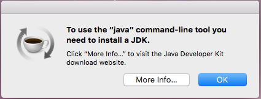
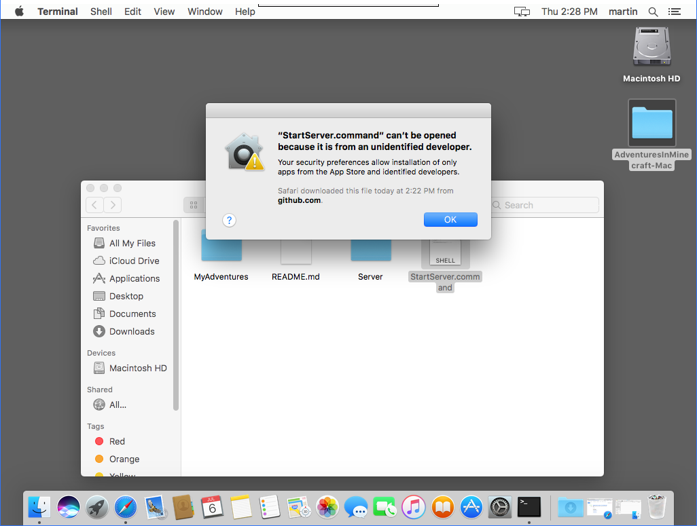
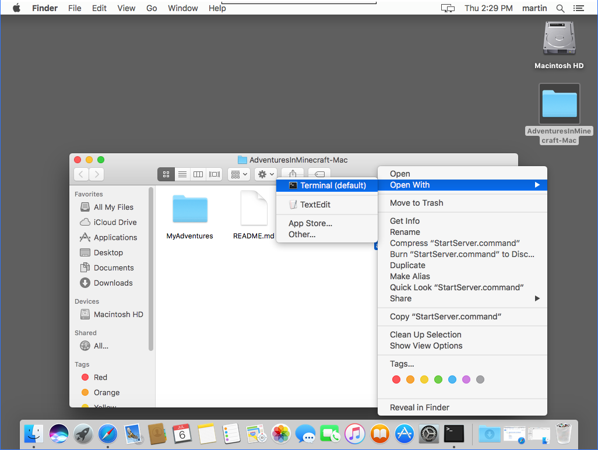

# Apple Mac - Help

## Troubleshooting
 * [You need to install a JDK](#installjdk)
 * [Java needs to be updated](#javaneedsupdating)
 * [StartServer.command can't be opened ... unidentified developer](#servercannotbeopened)

If your issue isn't answered here, please visit the [Adventures In Minecraft Forum](http://www.stuffaboutcode.com/p/adventures-in-minecraft-forum.html) and create a new post.

## To use Java you need to install a JDK  

When starting the Minecraft Server, you receive the message `To use the "java" command-line tool you need to install a JDK` - this is because the Java Development Kit (JDK) isn't install on your Mac.

Click `More Info...` and follow the instructions, or [download Mac OS JDK from Oracle's website](http://www.oracle.com/technetwork/java/javase/downloads/jdk8-downloads-2133151.html) and install. 

## Error - Java needs to be updated  

When starting the Minecraft Server, you receive `Error - Java needs to be updated.` - this is because your installed version of Java is less than `1.8`.

You should download and install the Java 1.8 JDK for Mac OS X. 

[Java 1.8 JDK Download Page](http://www.oracle.com/technetwork/java/javase/downloads/jdk8-downloads-2133151.html)

[Java 1.8 JDK Install Instructions](https://docs.oracle.com/javase/8/docs/technotes/guides/install/mac_jdk.html)

## StartServer.command cannot be opened  

When starting the Minecraft Server, you receive `"StartServer.command" can't be opened because it is from an unidentified developer `.

To run the server you should right click the file and choose `Open with`, `Terminal`.

