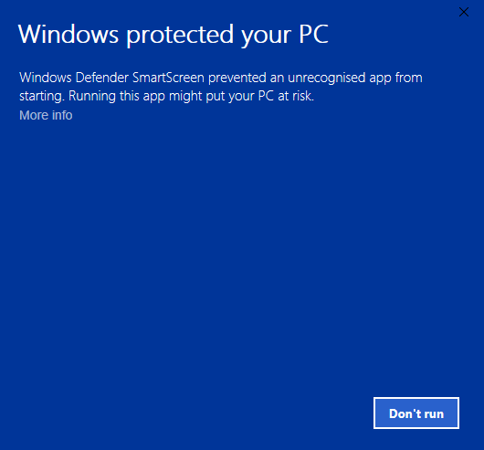
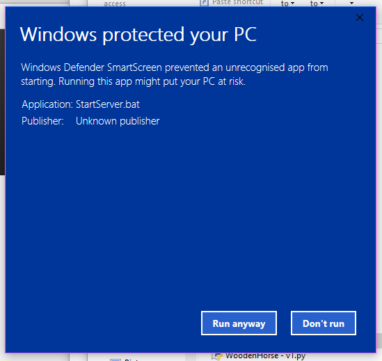

# Windows PC - Help

## Troubleshooting
 * [Windows protected your PC](#windowsprotectedpc)
 
## Windows protected your PC  

When starting the Minecraft Server, you receive a windows saying `Windows protected your PC`.

To run the server you should right click `More info` and `Run anyway`.

