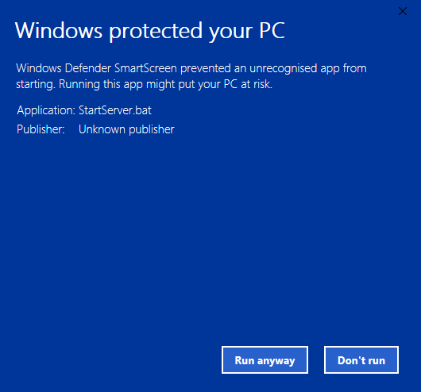

# Windows PC - Help

## Troubleshooting
 * [Windows protected your PC](#windowsprotectedpc)
 * [Open File - Security Warning](#openfilesecurity)
 * [Windows Firewall has blocked ...](#windowsfirewall)
 * [This application requires a Java Runtime ...](#javaruntimeinstall)

## Windows protected your PC  

When starting the Minecraft Server, you receive a windows saying `Windows protected your PC`.

To run the server you should right click `More info` and `Run anyway`.

## Windows protected your PC  

When starting the Minecraft Server, you receive a windows saying `Open File - Security Warning`.

To run the server you should un-tick `Always ask before opening this file` and click `Run`.

## Windows Firewall has blocked ...  

When starting the Minecraft Server, you receive a windows saying `Windows Firewall has blocked some features of this app`.

To run the server you should click `Always access`.

## This application requires Java ...  

When starting the Minecraft Server, the message `This application requires a Java Runtime Environment` - this is because Java isn't installed on your PC.

A browser window will open and take you to the Oracle Java download site.

Click `Free Java Download` and then `Agree and Start Free Download`.

When the Java installation has downloaded, run the program and follow the instructions to install Java.
